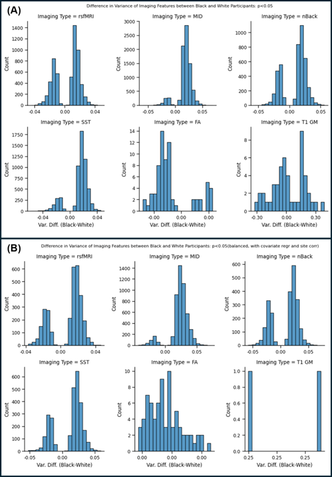
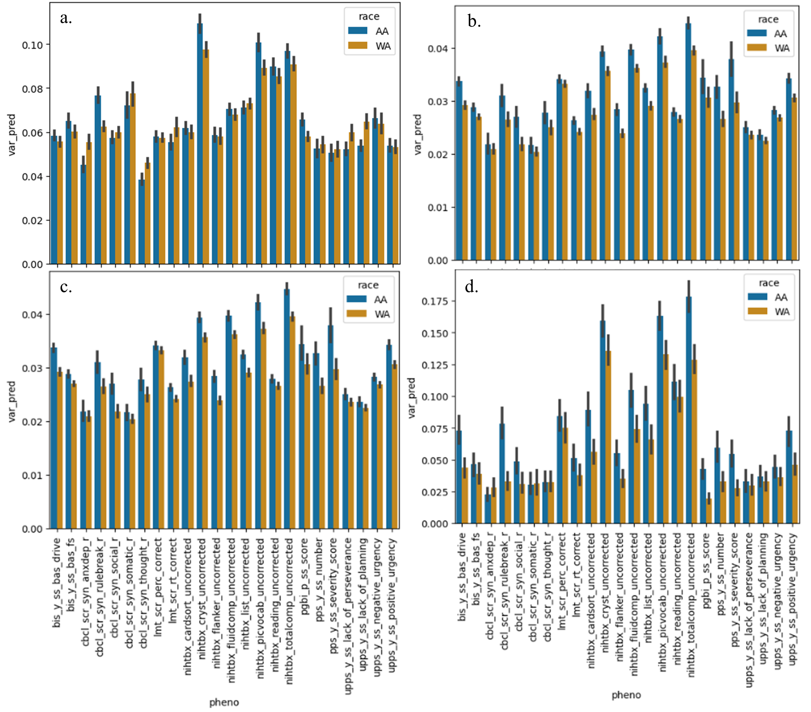

Code for the corresponding paper: "Racialized Heteroscedasticity in Connectome-Based Predictions of Brain-Behavior Relationships"

Authors: Christopher T. Fields, Matthew Rosenblatt, Joseph Aina, Jannat Thind, Annie Harper, Chyrell Bellamy, Xin Zhou, Alexandra Potter, Hugh Garavan, Nicholas Allgaier, Micah Johnson, Raimundo Rodriguez, Fahmi Khalifa, Deanna Barch, Dustin Scheinost

In each folder, code is listed step-by-step (e.g., 02_levenes_imaging/step01_run_levenes_test_fc.m)

This manuscript used a combination of matlab, python, and R.

# 01_levenes_behavioral

Contains code for testing for a difference in variance in behavioral measures

# 02_levenes_imaging

Contains code for testing for a difference in variance in imaging features

# 03_cpm

Contains code for testing whether the variance differs across CPM predictions

# 04_heteroscedasticity_simulation

Contains code for running a simulation to see how mean squared error changes with the variance of the independent and dependent variable
